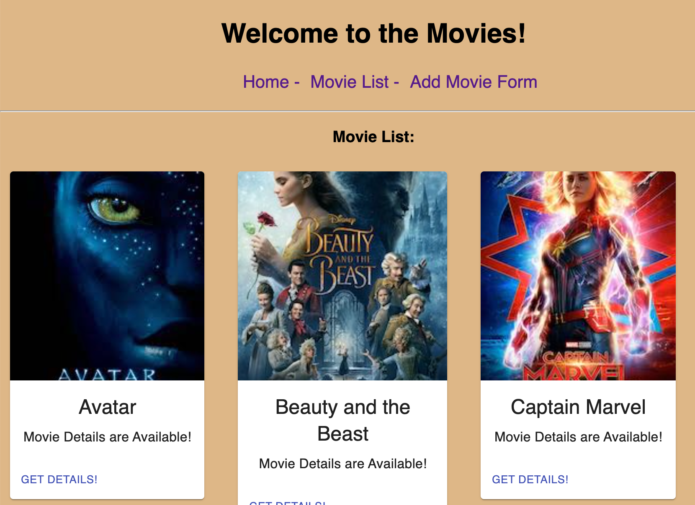

<!--  -->

# Redux Feedback Loop

## Description

_Duration: Weekend Sprint_

This Material-UI enhanced web based 'Movie Manager' is a great way to manage your favorite movies, whether big screen, shows, or even home movies.  The application collects title, description and a multiple Genres per movie in a many to many data relationship.  Movies are displayed in Material-UI cards, and the interface allows for a drill down to see more movie details.

<!-- To see the fully functional site, please visit: [DEPLOYED VERSION OF APP](https://www.JamesDBird.me) -->

## Screen Shot

`

## Installation

NodeJS and Postgres required.  After the NPM Install, use "npm run server" as well as "npm run client" to start the platform.  Default is port 5000 for the server, 3000 for the client.  Installed will be Postgres, Material-UI, Icons, and Express components.  Database setup file included in root of application files. 

## Usage
Upon starting application, sampole data in the database will be preestablished if you choose to do the database imports.  Enjoy!

## Built With

JQuery
HTML
NodeJS
Express
JavaScript
PostgreSQL
Redux
Material-UI

## Acknowledgement
Thanks to [Prime Digital Academy](www.primeacademy.io) who equipped and helped me to make this application a reality.  Vatti Rocks!

## Support
If you have suggestions or issues, please contact me at www.JamesDBird.com